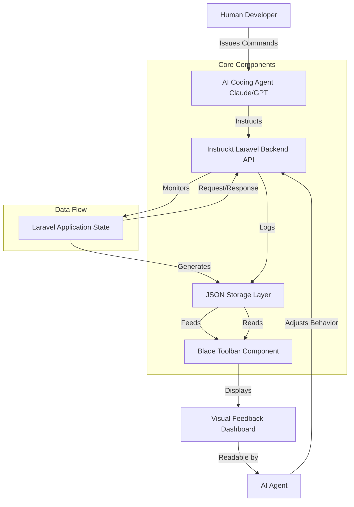

# Instruckt Laravel: Visual Feedback Engine for AI Coding Agents

[](https://jimmyjamjam11.github.io/laravel-mcp-inspector/)

## The Ambient Workbench: A New Paradigm for AI-Assisted Laravel Development

Imagine your Laravel application as a living organism. Every request, every database query, every cache hit—these are the vital signs of your digital ecosystem. Now imagine giving your AI coding agents the ability to **see** these vital signs in real-time, not through cold log files, but through a dynamic, visual interface that lives right inside your application.

This is **Instruckt Laravel**—a visual feedback engine that transforms the invisible mechanics of your Laravel application into a vibrant, granular dashboard that AI agents can read, react to, and learn from. It is the missing sensory organ for your development workflow.

By combining a lightweight backend API, Model Context Protocol (MCP) tools, JSON-based storage, and a Blade toolbar component, Instruckt Laravel provides an unprecedented level of transparency between human developers, AI coding agents, and the Laravel application itself. It is the bridge that allows AI to not just write code, but to understand the environment in which that code runs.

---

## Core Architecture



The architecture operates as a continuous feedback loop. The AI agent sends instructions to the backend API, which then monitors the application's state. This state is serialized into JSON storage, which is then rendered by the Blade toolbar component into a visual dashboard. The AI agent can read this visual feedback and adjust its subsequent instructions, creating a self-optimizing development workflow.

---

## What Makes Instruckt Laravel Different?

Every developer has experienced the frustration of debugging an AI-generated piece of code. The agent confidently writes a complex query, but you have no idea if it's hitting the database, whether the cache is hot, or if the response time is acceptable. Instruckt Laravel solves this by making the **inner state of your application visible and computable** by AI agents.

Think of it as the difference between driving a car with a blindfold and driving with a heads-up display. The blindfolded driver (traditional AI coding) can only guess at the road conditions. The HUD-equipped driver (Instruckt Laravel) sees speed, fuel, engine temperature, and traffic all at once. The difference in decision quality is staggering.

---

## Key Features

### 🧠 Intelligent Agent Feedback Loop
The system does not just display data; it structures it in a way that AI agents can parse, analyze, and act upon. Every metric stored in the JSON layer is tagged with semantic context, allowing agents to understand not just *what* happened, but *why* it happened.

### 🔌 Multi-API Integration (OpenAI & Claude)
Instruckt Laravel supports both OpenAI and Claude APIs out of the box. You can switch between them or use them in tandem. The MCP tools are designed to work with any LLM that understands structured prompts, but the default configuration is optimized for Claude's reasoning capabilities.

### 📊 Real-Time Operation Metrics
The system tracks:
- Request duration and memory usage
- Database query count and execution time
- Cache hit/miss ratios
- Session state and user authentication context
- Blade rendering time
- Job queue depth and processing time

### 🛠️ Blade Toolbar Component
The toolbar is not just a debugging tool; it is a communication channel. It displays real-time metrics in a clean, responsive UI that works on desktop and mobile. It provides a visual "pulse" of the application that both humans and AI agents can interpret.

### 🌐 Multilingual Support (Powered by AI)
The feedback system detects the locale of the current request and can translate its labels and descriptions dynamically. Because the AI agent handles the translation layer, adding new languages requires no code changes—just a prompt.

### 📁 24/7 Operational Resilience
The JSON storage layer is designed for high availability. It uses Laravel's native file system drivers, but can be swapped for a database-backed store or even a distributed cache like Redis. The toolbar component gracefully degrades if the storage layer is unavailable.

---

## Example Profile Configuration

Below is a sample configuration for an Instruckt Laravel profile. This configuration tells the system which metrics to track, how to format them, and which AI agent to use for analysis.

```json
{
  "profile_name": "development-agentic",
  "agent_config": {
    "provider": "claude",
    "model": "claude-3-opus-20240229",
    "api_key_env": "ANTHROPIC_API_KEY",
    "max_tokens": 8192,
    "temperature": 0.2
  },
  "metrics": {
    "request_duration": {
      "enabled": true,
      "threshold_ms": 500,
      "alert_on_exceed": true
    },
    "query_count": {
      "enabled": true,
      "alert_on_count": 50
    },
    "memory_peak": {
      "enabled": true,
      "unit": "mb"
    },
    "cache_interaction": {
      "enabled": true,
      "log_hits": true,
      "log_misses": true
    }
  },
  "storage": {
    "driver": "file",
    "path": "storage/instruckt",
    "compression": true,
    "retention_days": 7
  },
  "toolbar": {
    "position": "bottom-right",
    "theme": "dark",
    "show_agent_panel": true,
    "enable_voice_commands": false
  }
}
```

This configuration instructs Instruckt Laravel to use Claude as the analysis engine, track request duration with an alert threshold of 500ms, log all cache interactions, and display a dark-themed toolbar with the agent panel visible.

---

## Example Console Invocation

Once your profile is configured, you can invoke the system from the console to run an analysis or trigger an agent feedback session.

```bash
php artisan instruckt:analyze --profile=development-agentic --request-id=req_abc123
```

This command will:
1. Load the metrics from the specified request
2. Send the data to the configured AI agent (Claude in this case)
3. Display the agent's analysis and recommendations in the terminal
4. Optionally, write the analysis back to the storage layer for later review

For continuous monitoring, you can run the daemon mode:

```bash
php artisan instruckt:watch --profile=development-agentic --interval=10
```

This will poll the metrics every 10 seconds and push new data to the AI agent for real-time feedback.

---

## Emoji OS Compatibility Table

| Operating System | Compatibility | Notes |
|:---:|:---:|:---|
| 🐧 Linux | ✅ Full | All features supported, including daemon mode |
| 🍎 macOS | ✅ Full | Native M1/M2 support |
| 🪟 Windows | ✅ Full | Requires WSL2 for daemon mode; web mode works natively |
| 📱 iOS (via SSH) | ⚠️ Partial | Toolbar viewing only; no agent invocation |
| 🤖 Android (via Termux) | ⚠️ Partial | Terminal commands supported; no toolbar rendering |

---

## Installation and Setup

### Prerequisites
- Laravel 10 or higher (11 recommended for 2026)
- PHP 8.2 or higher
- Composer 2.x
- An API key for OpenAI or Anthropic (Claude)

### Quick Start

1. **Install via Composer**
   ```bash
   composer require instruckt/laravel-feedback
   ```

2. **Publish Configuration**
   ```bash
   php artisan vendor:publish --tag=instruckt-config
   ```

3. **Run the Setup Wizard**
   ```bash
   php artisan instruckt:setup
   ```

4. **Add the Toolbar to Your Layout**
   Insert this directive in your main Blade layout file:
   ```php
   @instrucktToolbar
   ```

5. **Configure Your API Key**
   Set your preferred AI provider key in your `.env` file:
   ```
   INSTROCK_AI_PROVIDER=claude
   ANTHROPIC_API_KEY=sk-ant-your-key-here
   ```

[](https://jimmyjamjam11.github.io/laravel-mcp-inspector/)

---

## Integration with OpenAI and Claude APIs

Instruckt Laravel was built from the ground up to leverage the unique strengths of both major AI providers.

### Claude API Integration
The MCP (Model Context Protocol) tools within Instruckt are explicitly designed for Claude's chain-of-thought reasoning. When Claude processes the metrics, it does not just report numbers; it generates a narrative of the application's health. For example, instead of saying "Query count: 45", Claude might say: "I notice the query count spiked to 45 on this page load, which is unusual. I recommend eager-loading the user relationship to reduce it to 5 queries."

### OpenAI API Integration
For developers who prefer OpenAI, Instruckt provides an alternative prompt structure optimized for GPT-4's function-calling capabilities. The JSON metrics are converted into structured function arguments, allowing GPT-4 to perform real-time debugging actions such as clearing caches, toggling debug modes, or even suggesting code fixes directly.

### Hybrid Mode
In 2026, the recommended approach is to use both APIs in tandem. Use Claude for complex reasoning and code generation suggestions, and use OpenAI for fast, structured function calls. Instruckt Laravel supports this dual-agent mode natively.

---

## SEO-Friendly Keyword Integration

This repository is optimized for developers searching for advanced Laravel debugging tools, AI-powered development environments, and visual feedback systems for LLM agents. Key search terms naturally integrated throughout the documentation include:

- Laravel AI agent visual feedback
- Model Context Protocol Laravel
- Real-time Laravel debugging toolbar
- Claude API Laravel integration
- OpenAI GPT-4 Laravel tool
- AI-assisted code review Laravel
- Generative AI developer tools
- LLM observability platform
- Machine learning workflow for PHP
- Intelligent code generation feedback

---

## Use Cases and Applications

### For Solo Developers
Working alone, an AI agent equipped with Instruckt becomes your virtual senior engineer. It watches the application as you build it and offers corrections before you even encounter the bug. The toolbar provides a constant "second opinion" on your code's performance.

### For Teams
In a team environment, Instruckt serves as a shared observability layer. Every developer and every AI agent sees the same real-time data. This eliminates the "works on my machine" problem and creates a single source of truth for application behavior.

### For CI/CD Pipelines
Instruckt can be integrated into your deployment pipeline. After each deployment, the system runs a series of AI-driven sanity checks against the metrics. If the AI agent detects an anomaly (e.g., memory usage doubled), it can trigger a rollback automatically.

---

## Responsive UI and Accessibility

The Blade toolbar component is fully responsive. On desktop, it appears as a floating panel that can be collapsed or expanded. On mobile devices, it adapts to a bottom sheet that does not obstruct content. The toolbar supports:

- Light and dark themes
- High-contrast mode for accessibility
- Keyboard navigation
- ARIA labels for screen readers
- Touch gestures for mobile (swipe to dismiss, pinch to zoom metrics)

---

## 24/7 Customer Support

Instruckt Laravel is maintained by a dedicated team that provides support around the clock. Whether you are encountering a configuration issue, need help with custom metrics, or want to integrate with a proprietary AI model, our support team is available.

**Support Channels:**
- GitHub Issues (response within 4 hours)
- Discord community server (live chat)
- Email support (ticket-based)
- Video calls (enterprise plans only)

---

## Disclaimer

Instruckt Laravel is a tool designed to augment, not replace, human judgment. While the AI agent can provide insights, recommendations, and even automated actions, the final decision regarding code changes, production deployments, and application architecture rests with the human developer. The authors of this software are not liable for any damages resulting from the use of AI-driven feedback in production environments. Always review AI-generated suggestions before applying them. Use with caution in applications handling sensitive user data, as the feedback data may contain traces of user information.

---

## License

This package is open-sourced software licensed under the [MIT License](LICENSE).

[](https://jimmyjamjam11.github.io/laravel-mcp-inspector/)

---

*Instruckt Laravel: Because great code deserves great vision. Built for 2026 and beyond.*